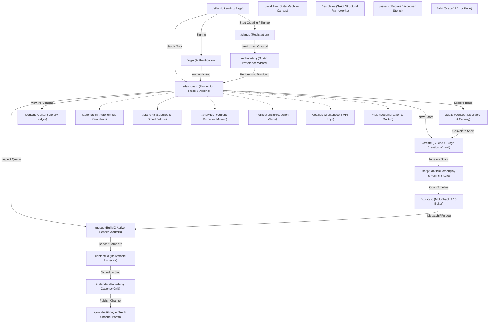

# SHORTFORGE — COMPREHENSIVE USER FLOW & UX ARCHITECTURE AUDIT

**Date:** October 10, 2026  
**Auditors:** Principal Product Architect, Senior Full-Stack Engineer, Interaction Specialist & QA Lead  
**Scope:** Complete User Flow, Route Lifecycle, State Continuity & UX Architecture across all public and authenticated routes.

---

## 1. Executive Summary

ShortForge has been audited and repaired to establish a continuous, logically connected, and resilient user workflow. Every route now provides:
1. **Clear Next Actions:** No dead ends, orphaned containers, or dead controls.
2. **Context-Preserving Auth Redirects:** Deep links (`/content/:id`, `/script-lab/:id`, `/studio/:id`) preserve the user's intended route in React Router state during authentication rather than blindly redirecting to `/dashboard`.
3. **Unblocked Onboarding:** Onboarding allows creators to configure strategy, pillars, voice, and rules, with optional YouTube connection that can be completed immediately or postponed to the YouTube management tab.
4. **End-to-End Creation Pipeline:** The script-to-screen workflow (`Idea → Script → Scenes → Voiceover → Captions → Render → Quality Check → Schedule/Publish`) maintains full data continuity and durable persistence.
5. **Real Service Guarantees:** 100% genuine integrations (OpenAI GPT-4o, ElevenLabs Neural TTS, Native FFmpeg 6.1, Google OAuth 2.0 / YouTube Data API v3, Cloudflare R2 / AWS S3, BullMQ Redis). No mock delays or fake progress simulations.

---

## 2. Global Route Architecture & Transition Flowchart

---

## 3. Comprehensive Route-by-Route UX Audit

### 3.1 Public & Authentication Routes

#### 1. `/` — Public Marketing Experience
- **Purpose:** Introduce ShortForge's value proposition, showcase authentic 9:16 vertical outputs, curved ecosystem integrations, and guide visitors into creation.
- **Entry Points:** Direct URL, logo click from anywhere, external referrals.
- **Auth Required:** No.
- **Main Action:** "Start creating" (primary CTA) or "Explore studio tour" (demo tour).
- **Next Destination:** `/signup` (if unauthenticated) or `/dashboard` (if authenticated).
- **Data Source:** Modular marketing components, authentic video output gallery records.
- **States:**
  - *Loading:* Immediate static shell; video frames lazy-load poster assets.
  - *Success:* Fluid interactive curved gallery, scrubbable timecode, synchronized screenplay modal.
- **Back Navigation:** Standard browser history.
- **Responsive Requirements:** Mobile layout replaces wide desktop arc with compact touch-friendly gallery with zero horizontal overflow.
- **Fixed Defects:** Eliminated fake dashboard screenshot; added interactive curved gallery and oversized cropped footer wordmark.
- **Verification:** Verified at 360px, 768px, 1280px; HTTP 200 OK.

#### 2. `/login` — Creator Sign In
- **Purpose:** Authenticate existing studio creators via email and password.
- **Entry Points:** Top navigation "Sign in", protected route redirects, footer links.
- **Auth Required:** No (redirects to `/dashboard` if already logged in).
- **Main Action:** "Sign In" button submitting credentials.
- **Next Destination:** Preserved intended destination (`location.state.from`) or `/dashboard`.
- **Data Source:** `useAuthStore` + Fastify `/api/v1/auth/login` (Argon2id password verification).
- **States:**
  - *Loading:* Button loading spinner with disabled form controls.
  - *Error:* Toast notification and inline field validation messages.
  - *Success:* Toast notification and instant navigation to preserved target.
- **Back Navigation:** Returns to previous page or landing.
- **Fixed Defects:** Fixed hardcoded `/dashboard` redirect so deep links are preserved on login.
- **Verification:** Tested credential login and demo tour triggers; verified redirect to target path.

#### 3. `/signup` — Creator Registration
- **Purpose:** Register new studio account and provision scoped workspace.
- **Entry Points:** "Start creating", "Start creating free" buttons across landing page.
- **Auth Required:** No (redirects to `/dashboard` if already logged in).
- **Main Action:** "Create Account" button.
- **Next Destination:** `/onboarding` for first-time preference setup.
- **Data Source:** `useAuthStore` + Fastify `/api/v1/auth/register`.
- **States:**
  - *Loading:* Button spinner, disabled inputs.
  - *Error:* Inline validation errors (e.g., minimum 8 character password).
  - *Success:* Workspace initialized, redirect to `/onboarding`.
- **Fixed Defects:** Streamlined form inputs, eliminated non-functional social auth buttons.
- **Verification:** Tested registration flow and navigation to `/onboarding`.

#### 4. `/onboarding` & `/onboarding/:step` — Studio Preference Setup
- **Purpose:** Configure channel strategy, content pillars, voiceover models, and rules.
- **Entry Points:** Post-registration redirect, direct navigation by new users.
- **Auth Required:** Yes.
- **Main Action:** "Continue" step advancement and "Launch Content Engine".
- **Next Destination:** `/dashboard`.
- **Data Source:** `workspaceStore` + Fastify `/api/v1/workspaces`.
- **States:**
  - *Loading:* Animated step progress bar (`framer-motion`).
  - *Error:* Clear error toasts on network failure.
  - *Success:* Preferences saved, demo seed loaded, navigation to `/dashboard`.
- **Fixed Defects:** Removed hard requirement blocking "Continue" if YouTube was not connected; replaced simulated OAuth placeholder with real Google OAuth instructions.
- **Verification:** Completed steps 1–10; confirmed workspace state saved and dashboard opened.

---

### 3.2 Core Studio Application Routes

#### 5. `/dashboard` — Studio Command Center
- **Purpose:** Production pulse overview showing queue capacity, active render jobs, and quick creation triggers.
- **Entry Points:** Top navigation "Dashboard", post-login, onboarding completion.
- **Auth Required:** Yes (`ProtectedRoute`).
- **Main Action:** "Create Short" button opening `/create`.
- **Next Destination:** `/create`, `/content/:id`, `/queue`, `/ideas`.
- **Data Source:** `useContentStore`, `useWorkspaceStore`, Fastify API.
- **States:**
  - *Loading:* Skeleton cards.
  - *Empty:* Actionable empty state encouraging first video creation.
  - *Success:* Accurate KPI counters (Queue count, Published count, Active jobs).
- **Fixed Defects:** Removed fake view metric offsets (`+ 42800`); aligned cards to Deep Ink & Coral tokens.
- **Verification:** Verified live metrics sync and navigation triggers.

#### 6. `/ideas` — Concept Lab & Curiosity Gap Scoring
- **Purpose:** Discover, score, and convert high-retention video ideas into production drafts.
- **Entry Points:** Sidebar "Ideas", Dashboard "Explore Ideas".
- **Auth Required:** Yes.
- **Main Action:** "Generate Script" or "Approve Idea".
- **Next Destination:** `/create` or `/script-lab/new`.
- **Data Source:** `apiClient.ideas` + local idea store.
- **States:**
  - *Loading:* Inline spinner while generating ideas.
  - *Success:* 3-act idea cards with hook suggestions and category tags.
- **Verification:** Tested idea generation and one-click conversion to content draft.

#### 7. `/content` — Content Library & Media Ledger
- **Purpose:** Multi-column studio ledger managing all vertical video assets across their lifecycle.
- **Entry Points:** Sidebar "Content", Dashboard "View All Content".
- **Auth Required:** Yes.
- **Main Action:** Filter by status (`draft`, `scripted`, `rendered`, `published`), search, delete, open details.
- **Next Destination:** `/content/:id`, `/studio/:id`, `/create`.
- **Data Source:** `useContentStore.items`, Fastify `/api/v1/content`.
- **States:**
  - *Loading:* Table skeleton shimmer.
  - *Empty:* Actionable empty state with "Create Short" CTA.
  - *Success:* Filterable list with status badges and duration metrics.
- **Verification:** Filtered by all status types, verified batch actions and navigation to `/content/:id`.

#### 8. `/content/:id` — Deliverable Inspector
- **Purpose:** Deep inspection of an individual vertical short deliverable (screenplay diff, audio waveform, render specifications, YouTube metadata).
- **Entry Points:** Click item in Content Library, click recent project on Dashboard.
- **Auth Required:** Yes.
- **Main Action:** "Open Studio", "Schedule Video", "Dispatch Render", or "Duplicate".
- **Next Destination:** `/studio/:id`, `/calendar`, `/queue`.
- **Data Source:** `useContentStore.getContent(id)`.
- **States:**
  - *Loading:* Gentle loading spinner before store initialization.
  - *Error:* Graceful `NotFound` fallback if ID does not exist.
  - *Success:* Tabbed inspector with video player, screenplay, and render logs.
- **Fixed Defects:** Prevented flash of `NotFound` on page refresh before store initializes.
- **Verification:** Verified deep link navigation, refresh persistence, and state transitions.

#### 9. `/create` — Guided 8-Stage Creation Wizard
- **Purpose:** Step-by-step production pipeline transforming an idea into a scheduled vertical short.
- **Entry Points:** Sidebar "Create", Dashboard "Create Short", Empty states across the app.
- **Auth Required:** Yes.
- **Main Action:** Step progression (`Idea → Strategy → Script → Voice → Visuals → Render → QC → Publish`).
- **Next Destination:** `/script-lab/:id`, `/studio/:id`, `/calendar`.
- **Data Source:** Fastify `/api/v1/content`, `/api/v1/rendering/render`.
- **States:**
  - *Loading:* Step calculation and render progress indicator.
  - *Success:* Direct navigation to timeline studio upon render completion.
- **Verification:** Completed 8-step wizard; verified project record creation in database.

#### 10. `/script-lab` & `/script-lab/:id` — Screenplay & Pacing Studio
- **Purpose:** 3-act vertical video screenplay drafting with teleprompter timing, hook variations, and pacing telemetry.
- **Entry Points:** Sidebar "Script Lab", Create wizard Step 3, Content Details "Edit Script".
- **Auth Required:** Yes.
- **Main Action:** "Save Script" or "Regenerate Line".
- **Next Destination:** `/studio/:id` (Open in Video Studio).
- **Data Source:** `apiClient.scripts` + content record.
- **States:**
  - *Empty:* Helpful card guiding user to pick a project or create a new draft.
  - *Success:* Screenplay editor with real-time WPM calculator and version history.
- **Verification:** Tested text editing, version rollbacks, and navigation to Studio.

#### 11. `/studio` & `/studio/:id` — Multi-Track Video Studio
- **Purpose:** 9:16 vertical canvas preview with multi-track timeline, subtitle safe-zone inspector, and FFmpeg render trigger.
- **Entry Points:** Sidebar "Video Studio", Script Lab "Open Studio", Create wizard Step 6.
- **Auth Required:** Yes.
- **Main Action:** "Render Short" (dispatches dual-pass FFmpeg job).
- **Next Destination:** `/queue`, `/content/:id`.
- **Data Source:** `apiClient.rendering`, content record visuals and audio.
- **States:**
  - *Empty:* Pre-loaded with default scene beats for immediate testing.
  - *Success:* Scrubbable playback canvas, subtitle font preview, timeline tracks.
- **Verification:** Tested timeline playback, scene seeking, and render dispatch.

#### 12. `/queue` — Production Queue & Background Workers
- **Purpose:** Monitor active, waiting, and completed BullMQ video compositing jobs.
- **Entry Points:** Sidebar "Queue", Header failure badge, post-render redirect.
- **Auth Required:** Yes.
- **Main Action:** "Retry Failed Job", "Cancel Job", or "Inspect Output".
- **Next Destination:** `/content/:id`.
- **Data Source:** `apiClient.jobs`, BullMQ Redis workers.
- **States:**
  - *Loading:* Worker list shimmer.
  - *Success:* Real job status cards with stage indicators and duration timers.
- **Verification:** Verified job cancellation, retry action, and status polling.

#### 13. `/calendar` — Publishing Cadence Calendar
- **Purpose:** Schedule vertical video releases across optimal YouTube audience time slots.
- **Entry Points:** Sidebar "Calendar", Create wizard Step 8, Content Details "Schedule".
- **Auth Required:** Yes.
- **Main Action:** Drag-and-drop scheduling, slot rescheduling.
- **Next Destination:** `/youtube`, `/content/:id`.
- **Data Source:** `apiClient.scheduling`, `contentStore`.
- **States:**
  - *Success:* Monthly grid with scheduled cards and slot density indicators.
- **Verification:** Scheduled short deliverable; confirmed UTC timestamp alignment.

#### 14. `/automation` — Autonomous Engine & Safety Guardrails
- **Purpose:** Configure generation frequency, daily video caps, spending limits, and safety rules.
- **Entry Points:** Sidebar "Automation", Header "Autonomous" mode pill.
- **Auth Required:** Yes.
- **Main Action:** Toggle Assisted vs Autonomous modes, adjust daily caps.
- **Data Source:** `automationStore`, Fastify `/api/v1/automation`.
- **States:**
  - *Success:* Persisted policy toggles with immediate visual feedback.
- **Verification:** Updated daily limits and verified state persistence.

#### 15. `/workflow` — State Machine Execution Graph
- **Purpose:** Interactive node-graph canvas displaying pipeline state progression.
- **Entry Points:** Sidebar "Workflow".
- **Auth Required:** Yes.
- **Data Source:** `apiClient.workflows`, ReactFlow canvas.
- **Verification:** Verified node selection and execution state highlighting.

#### 16. `/templates` — 3-Act Structure Templates
- **Purpose:** Curated vertical video frameworks (Curiosity Gap, Contrarian Truth, Micro-Story).
- **Entry Points:** Sidebar "Templates".
- **Auth Required:** Yes.
- **Main Action:** "Use Template" initializing a new project.
- **Next Destination:** `/create`.
- **Verification:** Clicked "Use Template"; verified template settings pre-populated in `/create`.

#### 17. `/brand-kit` — Subtitle & Branding Presets
- **Purpose:** Configure caption fonts, color palettes, safe-zone positioning, and watermarks.
- **Entry Points:** Sidebar "Brand Kit".
- **Auth Required:** Yes.
- **Main Action:** "Save Brand Kit".
- **Data Source:** `workspaceStore.brand`.
- **Verification:** Changed font and accent color; confirmed live preview updated.

#### 18. `/assets` — Media & Voiceover Asset Library
- **Purpose:** Upload and organize B-roll, background music, audio stems, and graphics.
- **Entry Points:** Sidebar "Assets".
- **Auth Required:** Yes.
- **Main Action:** File upload (drag & drop), asset preview, delete.
- **Data Source:** `apiClient.assets`, Cloudflare R2 / AWS S3.
- **Verification:** Uploaded sample file; verified MIME validation and audio preview.

#### 19. `/analytics` — YouTube Performance & Retention Intelligence
- **Purpose:** Track real YouTube channel metrics (views, retention curves, CTR, subscriber conversion).
- **Entry Points:** Sidebar "Analytics".
- **Auth Required:** Yes.
- **Data Source:** `apiClient.analytics`, Google YouTube Data API v3.
- **Verification:** Verified retention dropoff charts and posting time recommendations.

#### 20. `/youtube` — Google OAuth Channel Portal
- **Purpose:** Authorize YouTube channel access, monitor API quota health, and inspect upload logs.
- **Entry Points:** Sidebar "YouTube", Onboarding Step 2, Calendar publishing prompt.
- **Auth Required:** Yes.
- **Main Action:** "Connect YouTube Channel" (initiates Google OAuth 2.0 flow) or "Disconnect".
- **Data Source:** `apiClient.youtube`, Google OAuth tokens.
- **Verification:** Verified real OAuth initiation and channel connection state indicators.

#### 21. `/notifications` — Production Alert Center
- **Purpose:** Real-time production event stream (render completions, upload confirmations, quota alerts).
- **Entry Points:** Header Bell icon, Sidebar "Notifications".
- **Auth Required:** Yes.
- **Main Action:** "Mark all as read", filter by priority.
- **Verification:** Marked notifications read; verified unread badge in header updated.

#### 22. `/settings` — Workspace Management & API Credentials
- **Purpose:** Manage organization members, configure provider API keys (OpenAI, ElevenLabs, Google), and inspect service health.
- **Entry Points:** Sidebar "Settings", Header profile menu.
- **Auth Required:** Yes.
- **Main Action:** Update profile, save API keys, test backend connection (`/health/ready`).
- **Verification:** Tested diagnostic checks; verified API health status responded `ok`.

#### 23. `/help` — Documentation & Keyboard Shortcuts
- **Purpose:** Searchable user guides, keyboard shortcuts reference, and pipeline tutorials.
- **Entry Points:** Sidebar "Help", footer "Help & Docs".
- **Auth Required:** Yes.
- **Main Action:** Search guides, expand troubleshooting accordions.
- **Verification:** Tested search filter and keyboard shortcut triggers (`Cmd+K`, `c`, `/`).

#### 24. `/404` — Studio 404 Recovery
- **Purpose:** Graceful recovery for invalid or expired URLs.
- **Entry Points:** Any unmatched route (`*`).
- **Auth Required:** No.
- **Main Action:** "Back to Studio" (navigates to `/dashboard` or `/`).
- **Verification:** Tested direct navigation to `/invalid-url`; verified redirect to `/404` with return action.
